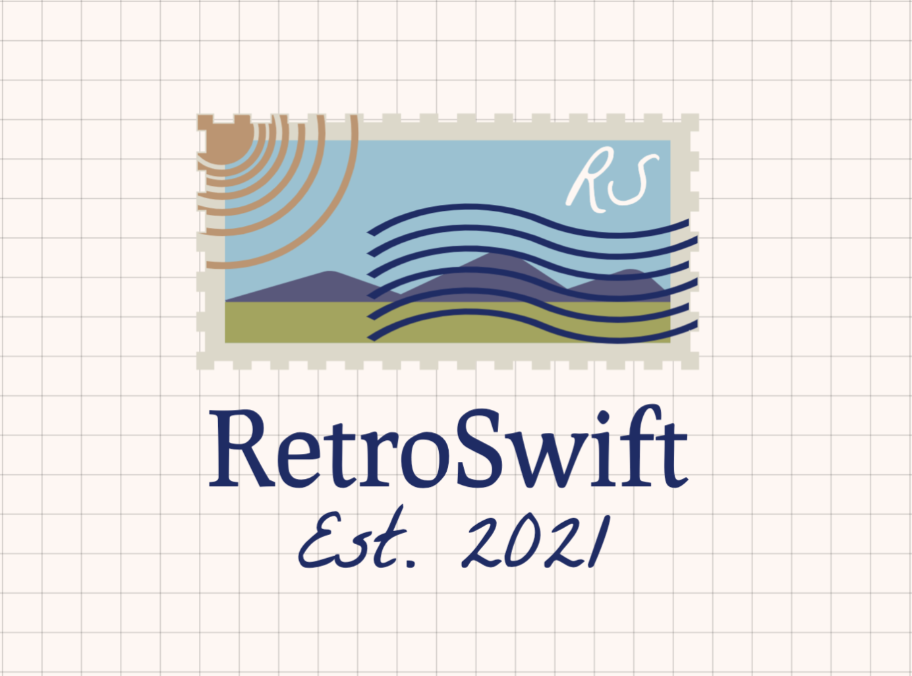

# RetroSwift
<p align="center" >
  
</p>

[](https://travis-ci.com/shericksam/RetroSwift)

RetroSwift is a simple RESTful API calls, automatically convert the HttpResponse into specified Model as well as the Error using the new apple ’s Codable feature.


  - Make sync request 


### Installation

RetroSwift requires [Swift 5](https://www.apple.com/mx/swift/).

Install the dependencies and devDependencies and start the server.

```Swift
dependencies: [
    .package(url: "https://github.com/shericksam/RetroSwift.git", from: "1.1.1")
]
```
### Start with RetroSwift

For example in a request for fetching specific user information and you have a `User` model, all you have to do is make the User model conforms to [Codable](https://developer.apple.com/documentation/swift/codable) and specify it when using the [RequestCaller](Sources/Services/RequestCaller.swift).

```json
{
  "name":"Erick",
  "email":"eguerrero@pleyme.com"
}
```

**`User` model that conforms to Codable.**
```Swift
struct User: Codable {
    var name: String
    var email: String
}
```

**This will automatically convert the response into an instance `User` model.**

Example:
```Swift
let baseUrl: String = "https://api.pleyme.com/api/v1"
var caller:RequestCaller =  {
        let config = URLSessionConfiguration.default
        if #available(iOS 11.0, *) {
            config.waitsForConnectivity = true
        }
        config.allowsConstrainedNetworkAccess = true
        config.urlCredentialStorage = .shared
        return RequestCaller(config: config)
    }()


func fetchUser(byUserId userId: Int) -> Result<UserResponse, ErrorModel> {
        let request = RequestModel(
            httpMethod: .get,
            path: "users/\(userId)",
            baseUrl: self.baseUrl
        )
            .asURLRequest()
        
        return self.caller.call(request)
 }
 
```

**Let say it’s an array of users; since Array conforms to Codable, all you have to do is specify the type to be `[User]`.**

Example:
```Swift
func fetchUsers() -> Result<UsersResponse, ErrorModel> {
    let request = RequestModel(
            httpMethod: .get,
            path: "users",
            baseUrl: self.baseUrl
        )
    return caller.call(request)
 }
 
 struct UsersResponse: Codable {
      var users: [User]
 }
```

About handling ResponseError:

**RetroSwift** provided a typealias **DecodableError** which is a combination of [HasErrorInfo](Sources/protocols/HasErrorInfo.swift), [Decodable](https://developer.apple.com/documentation/swift/decodable) protocol and [Error](https://developer.apple.com/documentation/swift/error) :

```Swift
public typealias DecodableError = Decodable & HasErrorInfo & Error
```

For example, the json error response of your login request is

```Swift
{
  "message": "Unable to login."
  "details": {
    "password": "You changed your password 2 months ago."
  }
}
```

And you have this as Model:
```Swift
struct ErrorModel {
    var errorCode: Int?
    var message: String
    var details: [String: String]
}
```

How about refresh tokens?

**RetroSwift** provide a callback that you can set custom requests when your request fails with http status **[401](https://developer.mozilla.org/es/docs/Web/HTTP/Status/401)**. 

```swift
private init() {
    self.caller.onFailRequestByAuth = onFailRequestAuth
}
    
func onFailRequestAuth(_ urlOld: URLRequest) -> URLRequest? {
    // your request that failed
    var urlOld = urlOld
    let request =  RequestModel(
        httpMethod: .post,
        path: "auth-server/oauth/token",
        query: ["oldToken": "eyJhbGciOiJIUzI1NiIsInR5cCI6IkpXVCJ9"],
        contentType: .Form
        )
            .asURLRequest()
    let resultCall: Result<AuthResponse, ErrorModel> = self.caller.call(request)
    do {
        let result = try resultCall.get()
        let newToken = result.accessToken
        // save if you needed
        UserDefaults.standard.set(newToken, forKey: "WebServiceToken")

        // set new token to old request
        urlOld.setValue("Bearer \(newToken)", forHTTPHeaderField: "Authorization")
        
        // Return request with new token in hearders
        return urlOld
    } catch {
        // If fails something, return nil for notifying it
        return nil
    }
}
```
The request is called again with the new token to return the requested data. 

### License
RetroSwift is released under the MIT license.

The MIT License (MIT)

Copyright (c) 2021 Pleyme

Permission is hereby granted, free of charge, to any person obtaining a copy of this software and associated documentation files (the "Software"), to deal in the Software without restriction, including without limitation the rights to use, copy, modify, merge, publish, distribute, sublicense, and/or sell copies of the Software, and to permit persons to whom the Software is furnished to do so, subject to the following conditions:

The above copyright notice and this permission notice shall be included in all copies or substantial portions of the Software.

THE SOFTWARE IS PROVIDED "AS IS", WITHOUT WARRANTY OF ANY KIND, EXPRESS OR IMPLIED, INCLUDING BUT NOT LIMITED TO THE WARRANTIES OF MERCHANTABILITY, FITNESS FOR A PARTICULAR PURPOSE AND NONINFRINGEMENT. IN NO EVENT SHALL THE AUTHORS OR COPYRIGHT HOLDERS BE LIABLE FOR ANY CLAIM, DAMAGES OR OTHER LIABILITY, WHETHER IN AN ACTION OF CONTRACT, TORT OR OTHERWISE, ARISING FROM, OUT OF OR IN CONNECTION WITH THE SOFTWARE OR THE USE OR OTHER DEALINGS IN THE SOFTWARE.

